# LAB1
Étape 2 — Importer l’OVA dans VirtualBox
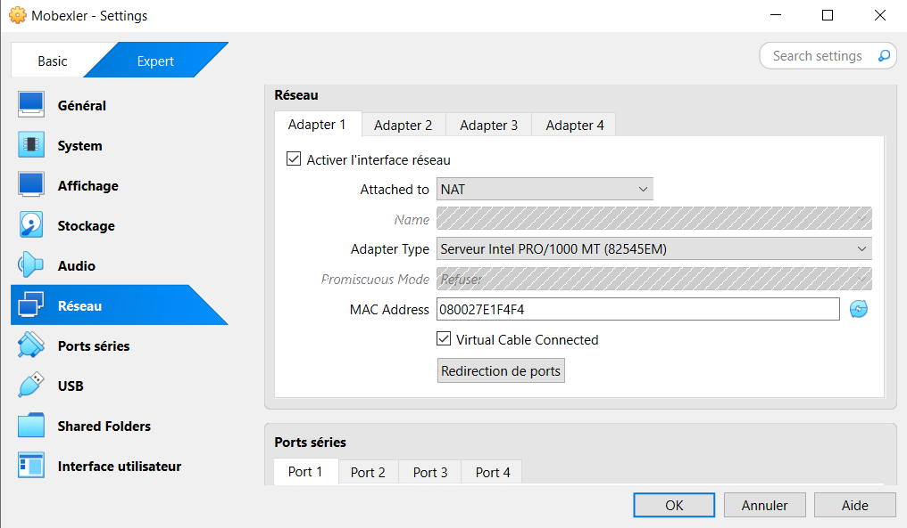
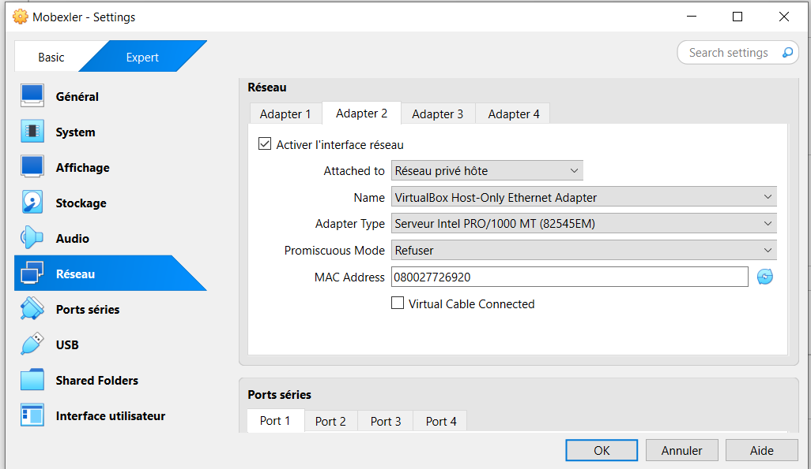

Étape 3 — Premier démarrage + connexion
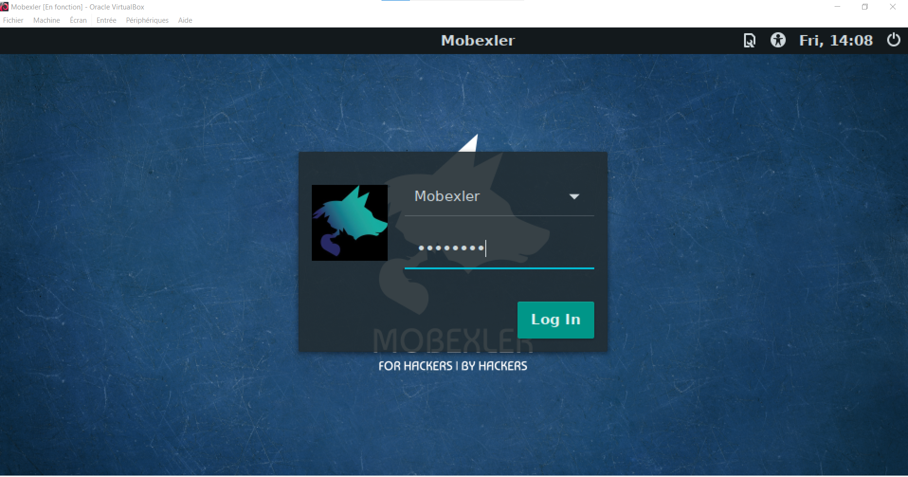
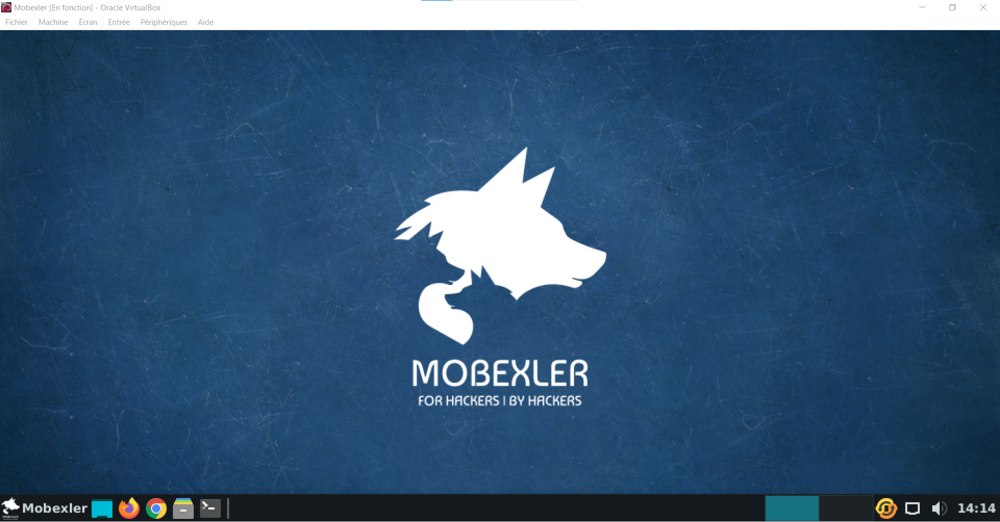

Étape 4 — Vérifier le réseau (tests “santé”)
Vérifier IPs
Interface Nat : enp0s17(10.0.2.15/24)
Interface Host-Only :enp0s8(192.168.56.103/24)

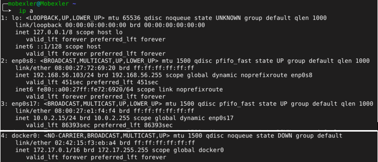

Vérifier la route par défaut :
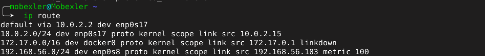

Tester Internet :
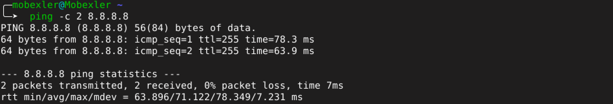
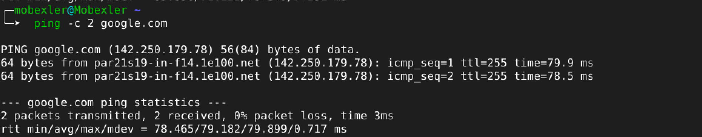

Étape 5 — Créer le snapshot “CLEAN” (baseline)
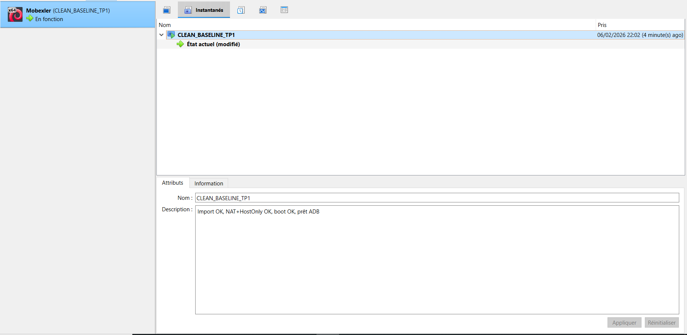

Étape 6 — Préparer la cible Android
Option B — Émulateur (Genymotion)
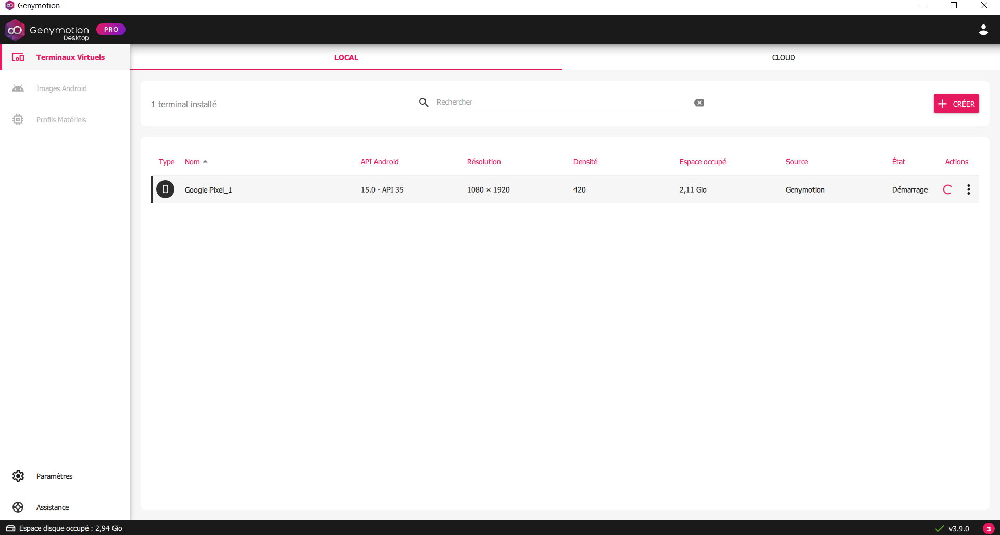
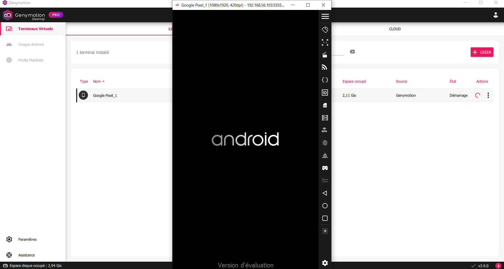

